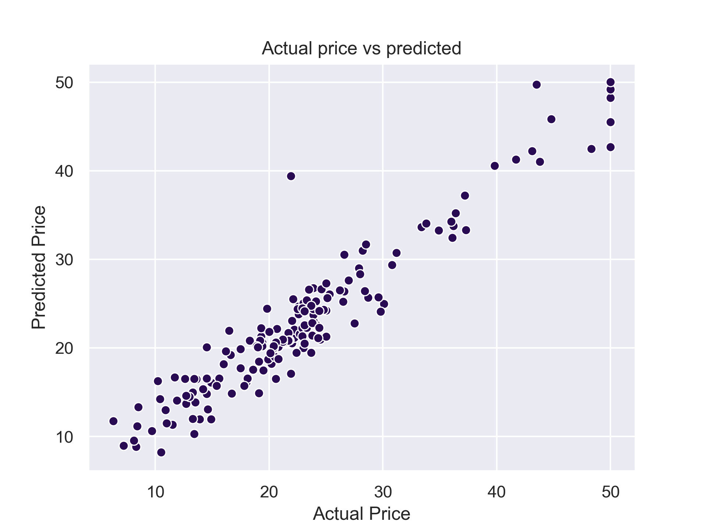
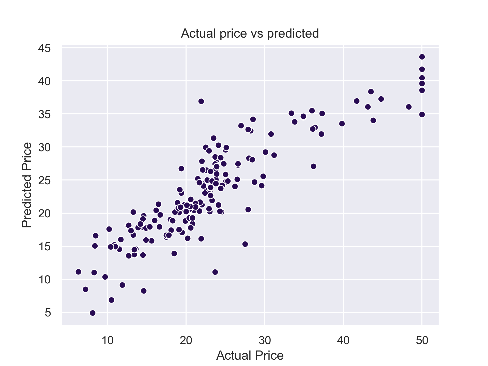

# Final-Project
Nataliia Kravchenko 2020/03/26

## Research Question
This project aimed on property price prediction using Boston data set.

## Abstract
The data set was downloaded from sklearn.datasets and it includes 506 rows and 14 columns.
We will be predicting a price of a house based on 14 features, which are organized into
columns. Within this project, we also use classification approach which is to predict weather
the house is situated nearby of the river tract.

In order to achieve these goals we will firstly compare algorithms and than use the most
accurate one. The most accurate algorithm will also be compared with Linear Regression outcome.
To predict the positioning of the house regarding the river tract, we will use Logistic
Regression.

We expect to predict the house price with the most possible accuracy and also asses whether
Logistic Regression can be used for classification of house position.

## Introduction
Boston data set was previously examined by the authors in previous tasks, so this code will
not be repeated here. The description of the data set might be obtained from here:
https://www.kaggle.com/c/boston-housing

## Methods
To choose the most accurate prediction model, we compared performance of the next algorithms:
Linear Regression, Gradient Boosting Regressor, ElasticNet, KNeighbors Regressor and Lasso.
We also tested the efficiency of Logistic regression to classify whether the hose is situated
near the river tract or not. As classifier we used Charles River dummy variable
(= 1 if tract bounds river; 0 otherwise).

## Results
According to Model choice. py GBR showed the best results: 

Reg Type|RMSE |MAE |R2
--------|-----|----|---
LR|4.227458|3.014124|0.750338
GBR|2.319936|1.741429|0.924813
EN|4.940514|3.451213|0.659013
KNR|5.809987|4.144910|0.528432
L|5.035146|3.508099|0.645825

This plot demonstarates the linear dependancy of actual vs predicted prices using GBR model:

For the comparison, we provide the same plot obtained from Linear Regression:

As we can see from this plot, data points distribution fluctuates more than when using GBR.

## Discussion

The best model for the hous price prediction was GBR which had minimum RSME and MAE scores and maximum
R2 scores among all models tested. 

As for Logistic Regression, we got the overall f1-score: 0.48104956268221566, which
is low result. Moreover, distribution of classifier was not even across the data set and the
poorest performance we obtained for the class "1". Precision was 0. This can be explained
with the high inequality of classifier variable distribution. Class "1" was rare in the data
set.

## References
Apart of the class material, we consulted the next links:
https://www.kaggle.com/shreayan98c/boston-house-price-prediction
https://www.kaggle.com/sagarnildass/predicting-boston-house-prices

 

